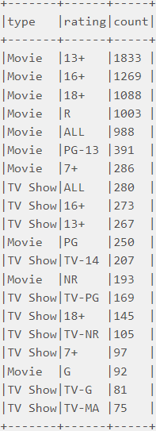
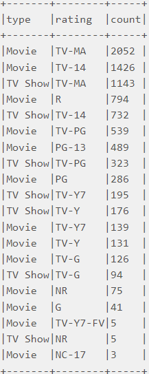
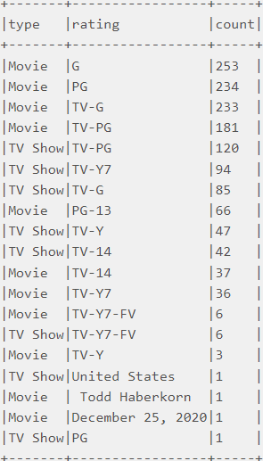

# Apache Airflow and Apache Spark Standalone Cluster on Docker

This project is based on this [material](https://airflow.apache.org/docs/apache-airflow/stable/start/docker.html).

It gives you an **Apache Airflow** configured with _LocalExecutor_ and **Apache Spark** cluster in standalone mode.
## Contents
- [Project overview](#project-overview)
- [Quick Start](#quick-start)
- [Dag example](#dag-example)
- [Additional resources](#additional-resources)

## <a name="project-overview"></a> Project overview
Apache Airflow version ```2.3```
with Postgres version ```13```

and Apache Spark version ```3.1.2```
with Hadoop version ```3.2```
### Apache Airflow
Application |Description
--|--
Postgres | Postgres database for Airflow metadata
Airflow-init  |  The initialization service
Airflow-worker|  The worker that executes the tasks given by the scheduler
Airflow-scheduler|  The scheduler monitors all tasks and DAGs
Airflow-webserver|  The webserver. Available at http://localhost:8080

<p align="center"></p>

### Apache Spark
Application |Description
--|--
Spark  | Spark Master node. Available at http://localhost:8181
Spark-worker-1  | Spark Worker node with 4 core and 4 gigabyte of memory (can be configured manually in docker-compose.yml)
Spark-worker-2  | Spark Worker node with 4 core and 4 gigabyte of memory (can be configured manually in docker-compose.yml)
Spark-worker-3  | Spark Worker node with 4 core and 4 gigabyte of memory (can be configured manually in docker-compose.yml)

<p align="center"></p>

## <a name="quick-start"></a> Quick Start
### Prerequisites

 - Install [Docker](https://docs.docker.com/get-docker/) and [Docker Compose](https://docs.docker.com/compose/install/)

### Clone Project
    git clone https://github.com/mbvyn/AirflowSpark.git

### Run containers
Inside the `AirflowSpark/docker/`

    docker compose up -d


### Check the access
 - [Airflow](http://localhost:8080)
   - **login**: airflow
   - **password**: airflow
 - [Spark](http://localhost:8181)

## <a name="dag-example"></a> Dag example
There is a simple spark job written in Scala.
Jar file is already created in ```docker/Volume/spark/app```,
but you also can check the [Spark Application](spark%20application).

Datasets for this example which you can find in ```docker/Volume/spark/resources```
can also be downloaded from www.kaggle.com
([link1](https://www.kaggle.com/datasets/shivamb/netflix-shows),
[link2](https://www.kaggle.com/datasets/shivamb/disney-movies-and-tv-shows),
[link3](https://www.kaggle.com/datasets/shivamb/amazon-prime-movies-and-tv-shows))

1. Go to [Airflow Web UI](http://localhost:8080).
2. Configure Spark Connection.

   2.1 Go to [Connection](http://localhost:8080/connection/list/)

   2.2 Add a new record like in the image below

<p align="center"></p>

3. Import variables.

    3.1 Go to [Variables](http://localhost:8080/variable/list/)

    3.2 Import variables from `docker/variables.json`

4. Run **simple_dag**
5. You can go to [Spark UI](http://localhost:8181) and see that spark has taken the jobs
<p align="center"></p>

6. In the graph section you will see something like this
<p align="center"></p>

7. And in logs you will find the output of our jobs
<p align="center">



</p>

## <a name="additional-resources"></a> Additional resources
1. [Running Airflow in Docker](https://airflow.apache.org/docs/apache-airflow/stable/start/docker.html#running-airflow-in-docker)
2. [Spark Standalone Mode](https://spark.apache.org/docs/latest/spark-standalone.html)
3. [Netflix Movies and TV Shows Dataset](https://www.kaggle.com/datasets/shivamb/netflix-shows)
4. [Disney+ Movies and TV Shows Dataset](https://www.kaggle.com/datasets/shivamb/disney-movies-and-tv-shows)
5. [Amazon Prime Movies and TV Shows Dataset](https://www.kaggle.com/datasets/shivamb/amazon-prime-movies-and-tv-shows)
